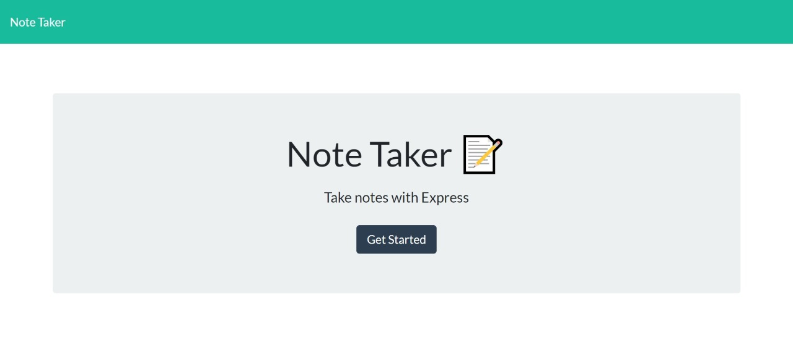
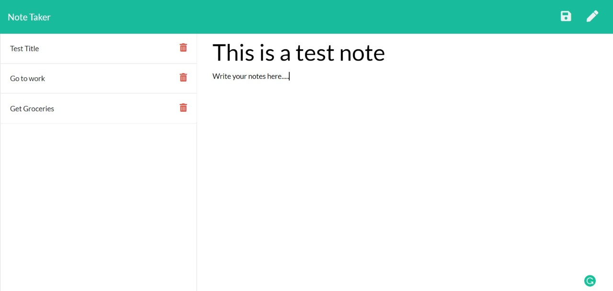

# The Note Taker

  ## Description

  I created this note taking app as a way to simplify note keeping process. This app should give users a simple and cost effective way to save ideas or throughts for later. The program is built for engineers and business professionals that need to simplify their note taking processes.

  ## Table of Contents

  * [Installation](#installation)
  * [Usage](#usage)
  * [License](#license)
  * [Contributors](#contributors)
  * [Questions](#questions?)
  * [Tests](#tests)

  ## Installation

  To use the program just [go to the website](https://wmccone-note-taker.herokuapp.com/). 

  ## Usage

  When using the app, write any notes you would like onto the right side of the page. You can save the note by clicking the floppy disc button in the upper right hand corner. You can then choose the note from the left hand side to view it at a later time. If you would like to delete the note just click the trashcan next to the note. If you would like to create a new note click the pencil button in the upper right hand corner.

  
  

  ## License

  

  ## Contributors

  N/A

  ## Questions?
  Follow me on Github
  [Wmccone](https://github.com/wmccone) 
  or 
  email me at gerrymccone88@gmail.com

  ## Tests

  N/A

